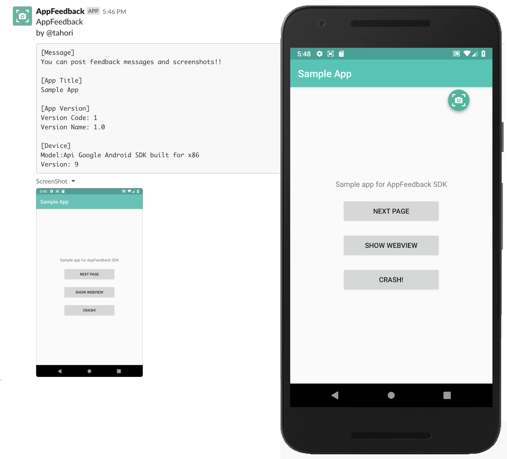

# AppFeedback
You can post feedback messages and screenshots to Slack from your Android app!



It is very useful for internal test!

## How to feedback

Introducing this SDK, a floating icon of feedback is displayed. Tapping it, a feedback dialog is displayed.

## Feature

- Show feedback button
- Two fingers long press to show feedback dialog
- Take a screenshot & Record screen

## Requirements

- **Minimum SDK Version** - requires a minimum SDK version of 19 or higher
- **Compile SDK Version** -  must be compiled against SDK version 27 or higher
- **Support Library Version** - uses support library version 27.

## Usage

### Integrate SDK

Open your module's build.gradle file.
Add the following manifest placeholder to your configuration (typically the defaultConfig):

```
repositories {
    jcenter()
}

dependencies {
    debugCompile 'jp.co.yahoo.appfeedback:appfeedback-sdk:1.+:debug@aar'

    // When using release build, SDK implementation is empty with same interface. 
    // So it does not affect application behavier.
    releaseCompile 'jp.co.yahoo.appfeedback:appfeedback-sdk:1.+:release@aar'
}
```

This library uses **support-v4** library, you must add a dependency to your build.gradle .


### MainActivity

Call `AppFeedback.start` in the MainActivity.

```
import jp.co.yahoo.appfeedback.core.AppFeedback;
  
public class MainActivity extends Activity {
    @Override
    protected void onCreate(Bundle savedInstanceState) {
        super.onCreate(savedInstanceState);
        setContentView(R.layout.activity_main);
 
        // Start feedback SDK
        AppFeedback.start(this,
                          "<slack token>",
                          "<slack channel id>");
        );
    }
```
